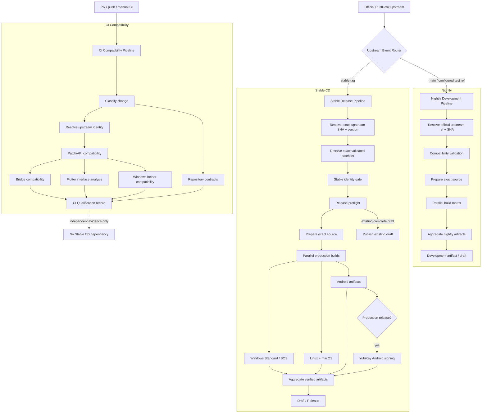

# CI/CD Architecture Flow

## 1. Source-of-truth rules

- Official upstream SHA is the source identity.
- Patchset is the customization generation applied to that exact upstream source.
- Version identifies the upstream release version.
- Custom repository SHA is provenance only; it is not a Stable eligibility gate.
- CI Qualification validates compatibility independently. Stable CD does not consume CI Qualification artifacts.

## 2. Functional flow

## 3. Windows helper

The Windows helper is used and therefore retained.

Production path:
Prepared Source -> Build Adapter resolves pinned helper commit -> Build shared WindowInjection helper once -> Verify helper SHA / architecture / upstream identity -> Upload helper artifact -> Windows Standard + SOS consume the same verified helper.

Deleting this job without replacing the helper would break the Windows build because the verified DLL is passed to the Windows build scripts through RUSTDESK_TOPMOST_DLL.

The separate helper validation in compat-check.yml is compatibility evidence. It does not gate Stable CD.

## 4. Ordering

### Stable
1. Resolve
2. Exact patchset
3. Identity validation
4. Release preflight
5. Prepare source
6. Build
7. Android production signing when required
8. Aggregate
9. Draft / Release

### Nightly
1. Resolve
2. Compatibility
3. Prepare source
4. Build
5. Aggregate
6. Development publication

### CI
1. Classify
2. Resolve
3. Compatibility
4. Qualification record

## 5. Hard separation

CI Qualification -> evidence only
Stable CD -> independent
Nightly -> independent

No Stable build or publication job may depend on:
- ci.yml
- CI Qualification artifacts
- ci-qualification-*
- compat-check.yml
- verify_source.py

Stable eligibility is limited to the exact upstream SHA, validated patchset, and version identity.
