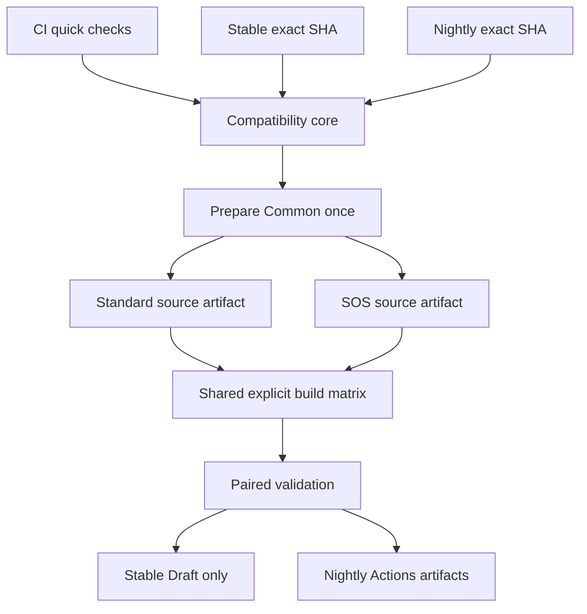

# Phase 4 Architecture and Verification

> Historical Phase 4 record consolidated from the former architecture audit and implementation verification report. Current CI/CD behavior is defined by the workflows and tests in the repository; this document preserves the Phase 4 evidence without treating historical claims as current state.

## 1. Architecture audit

# Phase 4 current architecture audit

Audit date: 2026-10-01. Read-only baseline: billradar/rustdesk-custom main
`219b688f8dfeb48015b0b3ac254cce62be6d04c7`.
Validated production dry run: https://github.com/billradar/rustdesk-custom/actions/runs/36854953000
Upstream 1.4.9: `6c578292e8ebbbec708b76986ba8c4bc7c509747`.

## Existing flow and evidence

`release-check.yml` -> `production.py discover` uses official Releases API, excludes drafts/prereleases, resolves tag to exact commit. Numeric official release tags are required. Deduplication checks revision, provenance and uploaded assets; incomplete existing versions fail closed.

`test-build.yml` independently resolves supplied SHA, runs `patchsets.py select`, preflight, bridge, Windows variant matrix, and compatibility aggregation. Known exact SHA mapping is authoritative; other SHAs try candidates in independent clean clones and fail if none satisfy both variant contracts. v1/v2 patches and metadata are hash verified.

`prepare.sh` fetches exact source and recursive official submodules. `apply-patches.sh` checks each patch before applying, including the small hbb_common submodule patch. No vendoring. Common applies to both variants; SOS only to SOS.

Production inputs: repository variables ID/Relay/API; repository secrets KEY/PASSWORD. Compiler environment injects configuration through frozen patches. `verify-source.py` checks contracts using fictional preflight configuration; `production_config.py` checks real inputs without printing them. `native_config_probe.py` queries the built DLL configuration via existing bridge, isolated from normal application startup. This is configuration validation, not UI/remote-session validation.

Windows uses build.py `--portable --flutter --skip-portable-pack --hwcodec --vram`; historical workflow pins Rust 1.75.0, Flutter 3.24.5, LLVM 15.0.6, vcpkg 120deac3062162151622ca4860575a33844ba10b. Bridge uses official Rust 1.75 / Flutter 3.22.3 / cargo-expand 1.0.95 / FRB 1.80.1 recipe. WindowInjection is separately built at ecd8d6a139eee76845ea66423fb739af450fda90. Packaging is an unsigned unpacked Flutter ZIP, not official installer/signing flow.

`package.py` verifies actual compiled configuration, DLL identity and AMD64 PE headers, emits build-info and per-file SHA256SUMS. `release.py collect` validates exactly one artifact per variant and shared source/patch/config/run identities. `production.py assets` scans captured completed job logs for known credential patterns and creates paired ZIPs/global checksums. Pattern scans are not a guarantee against all possible secrets.

## Preserve / refactor

Preserve unchanged v1/v2 patch bytes, resolver semantics, config interface, native configuration probe, actual build.py flags, checksum/architecture/provenance gates. Preserve old build entry as regression reference, not an automatic publication path.

Refactor duplicated upstream clones/patching per platform into prepared source. Split orchestration from shared build. Read reviewed official toolchain profiles at exact source rather than fixed historical dependency pins. Replace warning-only build-file monitoring with fail-closed adapter compatibility for critical definitions. Keep noncritical upstream changes as warnings.

Existing `production.py publish` creates a draft but then patches draft=false: this must be removed. Existing scheduled release-check must not retain an automatic published-release path. Stable becomes draft-only; Nightly artifacts-only. No runtime status upgrades.

## 2. Implementation and verification report

# Phase 4 architecture implementation and verification report

Date: 2026-10-01. Core acceptance completed against actual GitHub Actions runs.

Phase 4 Core Architecture: **PASS**. Nightly Schedule: **CONFIGURED / NOT OBSERVED**.
Runtime/UI: **SKIPPED BY USER**. Real remote session: **NOT TESTED**.
Code signing: **NOT ENABLED**. Password Security V2: **DEFERRED**.

## Immutable baseline

Repository: billradar/rustdesk-custom, main.
Phase 3 commit/workflow commit: `219b688f8dfeb48015b0b3ac254cce62be6d04c7`.
Workflow file blob: `2f651c966ae8f614f03aae13da509b4d4bfbc6a3`.
Dry Run: [36854953000](https://github.com/billradar/rustdesk-custom/actions/runs/36854953000), success, no release.
Upstream 1.4.9 SHA: `6c578292e8ebbbec708b76986ba8c4bc7c509747`; Patch Set v1.
Common hash: `87b7fb949b3bbc55c6d1e166909e167ebb8e0b6586630c0269f6440ba0542531`.
SOS hash: `d752022800a8008b10aedd1a79412a00af027464b1754b068c35a0b5b439ea34`.
Full machine-readable baseline: `metadata/PHASE3_BASELINE.json`; configuration fingerprint excludes password.

## Implementation commits

- `740f2f8b1ec8baf6db5544761aad374b6622a016`: baseline and architecture audits, before refactoring.
- `5307fad4a26857ef14ba10c1541dd07c6e3500fc`: shared compatibility, prepare and build, CI/Stable/Nightly.
- `f0f6d4ef7da9371f2b0c845a2c519aeedaed5d44`: tracked credential scan, preserve in-flight CI; docs-only changes do not launch expensive compatibility work.
- `5f6f2a585ff0c57daa386a7ee8cdc2d7c92a94f7`: engine/toolchain identity and explicit historical stable source/patch/config comparison.

Validated implementation reference: **31068343275299000954cf7e7d92ebdb186436b4**. An enclosing documentation-only commit may be newer.
No patch files or patchset metadata changed; v1/v2 hashes remain frozen. Existing native configuration probe remains unchanged. Phase 3 tested workflow remains a manual artifact-only reference, with its automatic publishing path removed.

## Architecture

Channel resolvers call official GitHub metadata once to lock exact SHA. Reusable compatibility accepts an exact SHA, not floating HEAD. Build jobs consume verified prepared source; no upstream re-resolution, no resolver, no patch application. Separate variant trees prevent Standard -> SOS contamination.

Prepared sources include official submodule structure, generated bridge, source inventory, archive SHA256 and source-manifest. Production values enter only compilation jobs. The manifest binds SHA/version, generation/hashes, custom repository commit, variant and prepare run. Build-info binds prepare/build runs and manifest hash, with exact toolchain/helper identities and downloaded engine hash.

## Upstream build adapter

Audited stable and development profiles come from exact SHA definitions, not current master settings applied to old source. Critical Windows job/global toolchain, Bridge/helper, build.py/build.rs and SDK patch signatures must match a reviewed profile. Unknown signature => BUILD_COMPATIBILITY FAIL before native dependency builds. Structural definitions changes require staging review, not automatic patch adaptation.

The adapter reads official toolchain/version/helper pins. It invokes target-source build.py with the validated Windows flags. GitHub cannot dynamically execute a fetched local reusable workflow; direct official invocation would also checkout unpatched source and use official publication assumptions. Our small reviewed adapter preserves the known recipe rather than vendoring the whole official workflow. Noncritical build-file changes remain warnings.

Master audit: `fada664df7a294d1d1a9ca3e7cd3637069122f17`, default branch `master`, source version **1.5.0**. Its vcpkg pin is 9e593bb18ea69cc5095e012465dcd675a822ed0d; the new CMake 4.3.0 setting is for Linux ARM64, not a Windows toolchain requirement. Default bridge remains Flutter 3.22.3; Windows Flutter is 3.24.5.

Development's source SBOM request is implemented per patched prepared variant using pinned Syft installer e22c389904149dbc22b58101806040fa8d37a610. It is a **source SBOM**, not a complete compiled-binary inventory; the Nightly prepare job completed successfully on run 36872771101.

## Actual verification

All three channel runs used implementation SHA `31068343275299000954cf7e7d92ebdb186436b4`.

| Item | Actual result / evidence |
|---|---|
| Local regression/unit tests | PASS: 45 tests, including parallel dependency/gate contracts |
| CI compatibility core | PASS: [36865665982](https://github.com/billradar/rustdesk-custom/actions/runs/36865665982) |
| Stable exact SHA / v1 resolver / build adapter | PASS: [36865945733](https://github.com/billradar/rustdesk-custom/actions/runs/36865945733) |
| Stable Standard/SOS prepared sources and manifests | PASS; both artifacts generated and consumed by separate Windows jobs |
| Stable Windows x86_64 Standard/SOS regression | PASS; both builds ran in parallel |
| Stable production config / baseline identity / checksum / architecture / provenance / known credential gates | PASS; paired build/validate job success |
| Stable Draft creation | PASS; release ID 401019227, title v1.4.9-custom.1, draft=true, published_at=null |
| Nightly development exact SHA / v2 resolver / build adapter | PASS: [36872771101](https://github.com/billradar/rustdesk-custom/actions/runs/36872771101) |
| Nightly Common/SOS, Config/API, actual Rust fast checks, Bridge, Flutter analyze | PASS; all compatibility jobs success |
| Nightly prepared Standard/SOS source and manifests | PASS; separate source artifacts consumed by Windows build jobs |
| Nightly Windows x86_64 Standard/SOS | PASS; both build jobs success |
| Nightly metadata / checksums / AMD64 architecture / production fixture and known credential scans / paired provenance gate | PASS; build/validate job success |
| Nightly release policy | Actions artifacts only; no release job |
| Nightly scheduled execution | CONFIGURED / NOT OBSERVED; successful run was workflow_dispatch |

Stable provenance: upstream tag **1.4.9**, exact SHA `6c578292e8ebbbec708b76986ba8c4bc7c509747`, patchset **v1**, unchanged baseline Common/SOS hashes.

Nightly provenance: upstream default branch **master**, source version **1.5.0**, exact SHA `fada664df7a294d1d1a9ca3e7cd3637069122f17`, selected patchset **v2**.
Common hash: `a62750763d0ddec4f8f0358b20060db7734ef9e2b7a84cbc400b7a38c2f2c8e7`.
SOS hash: `076a08c0d4a710e19ce08fd6e77f0c207293868b98c83a6471ab9a77e5d40813`.

Nightly client artifact names:
- `rustdesk-nightly-1.5.0-fada664df7a294d1d1a9ca3e7cd3637069122f17-standard-windows-x86_64`
- `rustdesk-nightly-1.5.0-fada664df7a294d1d1a9ca3e7cd3637069122f17-sos-windows-x86_64`

Stable Draft assets: Standard/SOS Windows ZIPs, build-info-standard.json, build-info-sos.json and SHA256SUMS. Automated publication remains disabled. GitHub currently exposes the unpublished draft under an untagged temporary identifier; title is v1.4.9-custom.1. No manual publication performed.

Successful compilation and native configuration probes do not establish runtime/UI or real remote-session correctness.

## Channels and release protection

Stable: official nondraft/nonprerelease Releases with valid numeric release tags; locks resolved commit, deduplicates completed Drafts or published revisions and checks patch identities/assets. Incomplete existing versions stop. Force existing revision => artifacts only, never overwrite. New pipeline creates a Draft only after shared pair validation. All POST/PATCH release payloads keep `draft: true`; no automatic publish job. Only Draft job has contents:write. Manual dry_run defaults true; scheduled stable may create a Draft after gates succeed.

Nightly: detects official default branch, exact SHA, version from that SHA's Cargo.toml, both variants via shared core; artifacts only with version/SHA identity and 14-day retention. Nightly does not publish or modify stable releases. Prepared source retention is 7 days. No nightly dedup optimization yet; manual dispatch always runs.

CI: no production secrets, no release job, fictional configuration only; actual Rust config compilation plus generated Bridge/Flutter error checking. Upstream lint warnings retained; errors fail. No `continue-on-error` for key gates.

## Schedule evidence

Nightly cron **0 2 * * ***: **CONFIGURED / NOT OBSERVED**. No manual run is counted as schedule evidence.

A newly observed staging schedule run [36857579026](https://github.com/billradar/rustdesk-custom-test/actions/runs/36857579026), event=schedule, success, started 2026-10-01T11:47:33Z, was **Stable discovery**: discover PASS, build/prerelease SKIPPED. This proves scheduled stable discovery/dedup only. It does **not** prove the original scheduled Compatibility compile/Bridge/Flutter flow; that acceptance remains pending. Existing historical reports were not rewritten to claim broader PASS.

## Matrix

Baseline SUPPORTED: Windows x86_64 Standard and SOS (Dry Run 36854953000). Phase 4 Windows x86_64 regression PASS on Stable run 36865945733; development v2 builds PASS on Nightly run 36872771101.
Explicit enabled build include contains only these two entries, not a platform/arch/variant Cartesian product. `metadata/platform-matrix.json` records planned disabled targets with support status.
PLANNED / NOT VALIDATED: Windows ARM64 Standard/SOS; Linux x86_64/ARM64 Standard/SOS; macOS Intel/Apple Silicon Standard/SOS; Android ARM64/ARMv7/x86_64 Standard; iOS ARM64 Standard; Web Standard.
Android SOS, iOS SOS, Web SOS: **NOT PLANNED**, absent from entries.

## Security and limitations

Default contents:read. Artifact/log aggregation uses actions:read. Only Draft job contents:write. Same-repository GITHUB_TOKEN, no added PAT. Important Actions pinned to commits. Input values passed through env; upstream refs/SHA/version identities validated. No pull_request_target. PR compatibility uses fictional inputs.

Production config interface unchanged: variables ID/Relay/API; secrets KEY/PASSWORD. Public key is not a server private key. Embedded password/config is extractable by client owners. Scans detect known credential patterns, not all encoded credentials. Repo scan detects complete private-key blocks (synthetic header-only test strings are not key material); payload/log scan remains stricter. No real secret value/password hash added to Git or manifests.

Floating official engine main release, hosted runners/system packages prevent byte-for-byte reproducibility claims; engine archive SHA is now emitted into build-info along with toolchains. New adapter profiles require staging review. Existing full Windows builds remain expensive. No new OS/architecture claimed supported.

Runtime/UI SKIPPED BY USER; real remote session NOT TESTED; unsigned binaries; Password Security V2 DEFERRED. No runtime tests, signing, new platform builds or old-system retirement performed.

## Completion and deferred work

Core architecture acceptance: **PASS**. CI, Stable Draft and Nightly manual paths completed successfully with actual prepared-source consumption and paired validation.

Nightly schedule remains **CONFIGURED / NOT OBSERVED** until a real schedule event completes. No manual run substitutes for that evidence. The Phase 3 historical compatibility schedule status is unchanged.

Stop at this phase. No additional platform builds, signing, Password Security V2, runtime/UI, real remote sessions, automatic publication or old-system retirement are authorized by this completion.

## Old repository safety

billradar/rustdesk: ZERO WRITES by this task.
billradar/rustdesk-sos: ZERO WRITES by this task.
Historical tags/releases/actions unchanged. Staging repository only read for evidence. No production publish, archive, deletion or old-release replacement.

