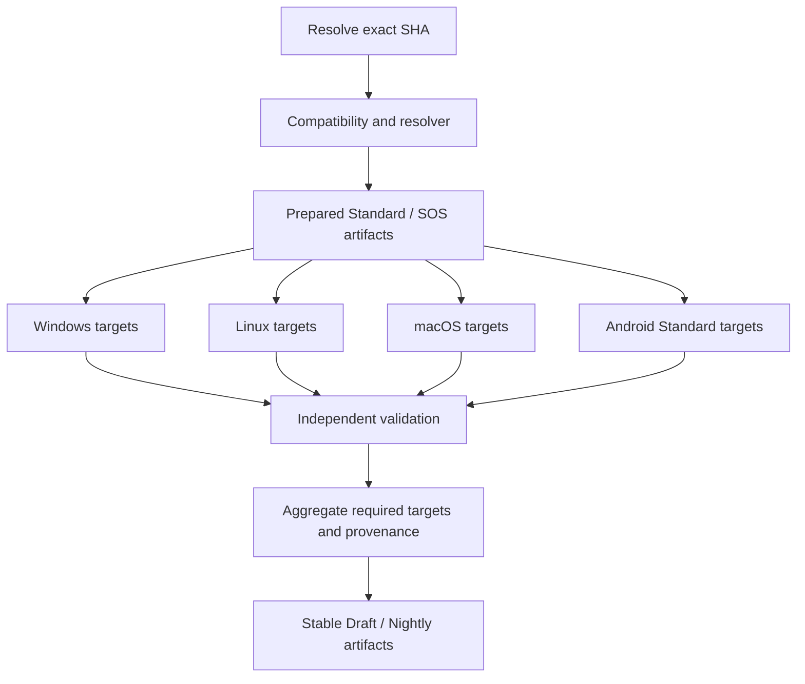

# Build dependency map

| Input/output | Sharing rule | Reason |
|---|---|---|
| Official source + recursive submodules | once per exact SHA | common immutable source identity |
| Patched Common baseline | once per selected patchset/hash | identical Standard/SOS customization |
| Standard/SOS source archive | separate artifacts | SOS UI delta must not contaminate Standard |
| Default FRB bridge | share at same exact SHA/profile | current patches do not modify flutter_ffi.rs bridge declarations; require file hash and bridge SHA checks |
| WindowInjection.dll | same helper commit + Windows arch | independent source, target-specific; never share across architectures |
| Rust/Flutter compiled app | never across variants/architectures | patched UI, environment configuration and native target matter |
| vcpkg packages | only same manifest/toolchain/triplet | caches accelerate, not trusted provenance |
| SBOM | per patched variant or final artifact | official unpatched SBOM is not ours |
| Native config probe | per final DLL | verifies actual packaged config, including password, without printing values |

Prepared source contains no production inputs. Configuration enters only platform compile jobs. Cargo/Flutter dependency caches are optional acceleration. Prepared source is a run-bound artifact and must be verified after download.

## current build architecture fan-out / fan-in

Each target is a separate platform/architecture/variant job, `fail-fast: false`, with no dependency on another platform's build. Actual runner overlap is proven by run 36902005326: Linux x86_64 Standard and macOS ARM64 Standard overlap 18:01:42–18:26:15 UTC on 2026-10-01. Existing Windows pair validation remains a regression gate. Aggregate waits for all selected target jobs and records failed experimental targets without promoting them.

| Dependency | Class | current build architecture treatment |
|---|---|---|
| Exact SHA, patch resolver | SHARED | Central selection only |
| Standard / SOS archive and manifest | VARIANT-SPECIFIC, shared across platforms | Artifact, verified before every consumer |
| Default Bridge source | SHARED only within reviewed profile | Already embedded in prepared source; Windows ARM requires a different profile and remains planned |
| Windows helper binary | PLATFORM-SPECIFIC + ARCH-SPECIFIC | Existing x64 helper only; never reused on Linux/macOS |
| Compiler, Flutter, NDK, vcpkg | PLATFORM-SPECIFIC + ARCH-SPECIFIC | Read/check the exact-source official profile; downloads/cache are not provenance |
| Linux container dependency install | PLATFORM-SPECIFIC + ARCH-SPECIFIC | Official recipe, no client configuration stored in image layers |
| Client compile/config injection | VARIANT-SPECIFIC + PLATFORM-SPECIFIC + ARCH-SPECIFIC | Independent job; no shared compiled app |
| deb/rpm, DMG, APK | PLATFORM-SPECIFIC + ARCH-SPECIFIC | Native package validation on target runner; explicit unsigned/test-signing status |
| Native configuration probe | PLATFORM-SPECIFIC | Windows/Linux/macOS library ABI probe, no UI/server/session; Android compiler MIR plus packaged native library identity; production signing identity is not validated |
| Source SBOM | VARIANT-SPECIFIC | Patched source inventory, not an unpatched upstream binary SBOM |
| Checksums/provenance aggregate | SHARED | Expected required set, unique target identity, shared SHA/Common/variant-source identity |

Windows ARM64/iOS/Web are not enabled platform consumers at this checkpoint. See `platform-support.md` for precise reasons. There are no platform source patches yet; if needed, their hash must enter provenance before promotion.
