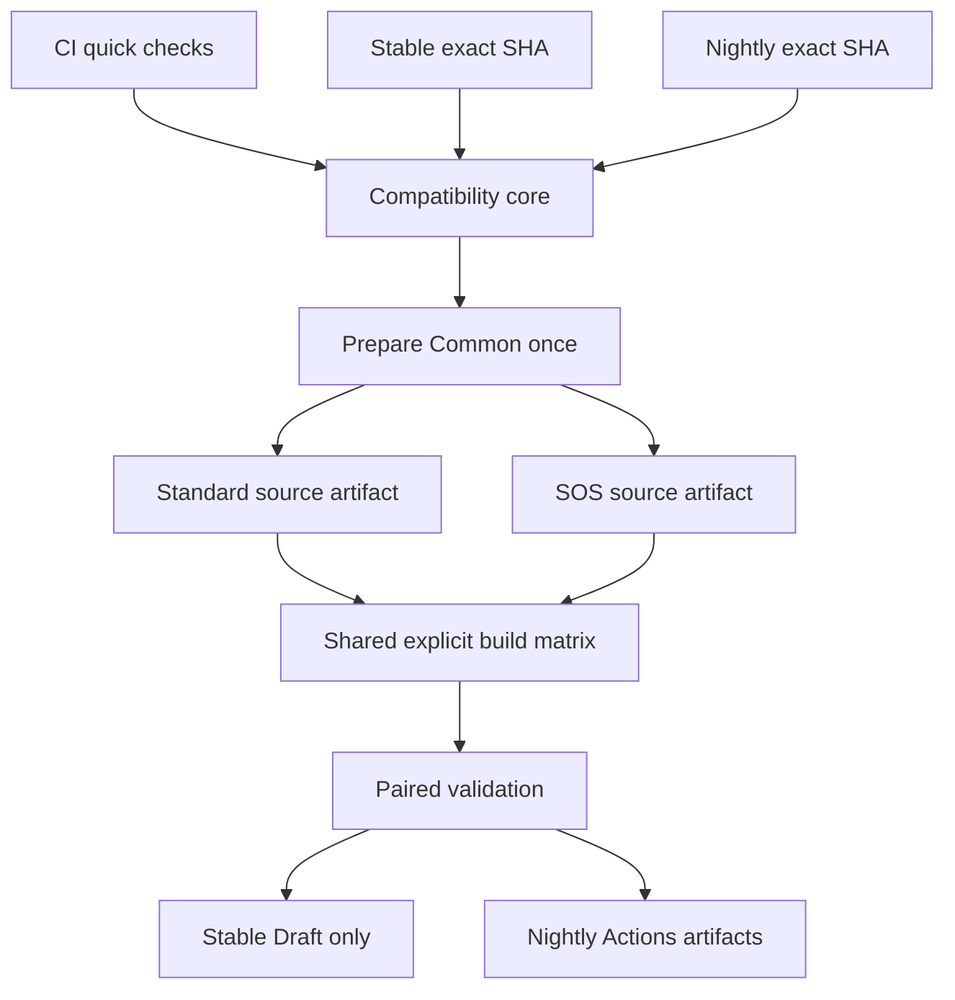

# Phase 4 architecture implementation and verification report

Date: 2026-10-01. This is an implementation checkpoint, **not completed Phase 4 acceptance**.

Phase 4 Core Architecture: **PENDING ACTIONS VALIDATION**.
Runtime/UI: **SKIPPED BY USER**. Real remote session: **NOT TESTED**.
Code signing: **NOT ENABLED**. Password Security V2: **DEFERRED**.

## Immutable baseline

Repository: billradar/rustdesk-custom, main.
Phase 3 commit/workflow commit: `219b688f8dfeb48015b0b3ac254cce62be6d04c7`.
Workflow file blob: `2f651c966ae8f614f03aae13da509b4d4bfbc6a3`.
Dry Run: [36854953000](https://github.com/billradar/rustdesk-custom/actions/runs/36854953000), success, no release.
Upstream 1.4.9 SHA: `6c578292e8ebbbec708b76986ba8c4bc7c509747`; Patch Set v1.
Common hash: `87b7fb949b3bbc55c6d1e166909e167ebb8e0b6586630c0269f6440ba0542531`.
SOS hash: `d752022800a8008b10aedd1a79412a00af027464b1754b068c35a0b5b439ea34`.
Full machine-readable baseline: `metadata/PHASE3_BASELINE.json`; configuration fingerprint excludes password.

## Implementation commits

- `740f2f8b1ec8baf6db5544761aad374b6622a016`: baseline and architecture audits, before refactoring.
- `5307fad4a26857ef14ba10c1541dd07c6e3500fc`: shared compatibility, prepare and build, CI/Stable/Nightly.
- `f0f6d4ef7da9371f2b0c845a2c519aeedaed5d44`: tracked credential scan, preserve in-flight CI; docs-only changes do not launch expensive compatibility work.
- `5f6f2a585ff0c57daa386a7ee8cdc2d7c92a94f7`: engine/toolchain identity and explicit historical stable source/patch/config comparison.

Implementation reference: **5f6f2a585ff0c57daa386a7ee8cdc2d7c92a94f7**. An enclosing documentation-only commit may be newer.
No patch files or patchset metadata changed; v1/v2 hashes remain frozen. Existing native configuration probe remains unchanged. Phase 3 tested workflow remains a manual artifact-only reference, with its automatic publishing path removed.

## Architecture

Channel resolvers call official GitHub metadata once to lock exact SHA. Reusable compatibility accepts an exact SHA, not floating HEAD. Build jobs consume verified prepared source; no upstream re-resolution, no resolver, no patch application. Separate variant trees prevent Standard -> SOS contamination.

Prepared sources include official submodule structure, generated bridge, source inventory, archive SHA256 and source-manifest. Production values enter only compilation jobs. The manifest binds SHA/version, generation/hashes, custom repository commit, variant and prepare run. Build-info binds prepare/build runs and manifest hash, with exact toolchain/helper identities and downloaded engine hash.

## Upstream build adapter

Audited stable and development profiles come from exact SHA definitions, not current master settings applied to old source. Critical Windows job/global toolchain, Bridge/helper, build.py/build.rs and SDK patch signatures must match a reviewed profile. Unknown signature => BUILD_COMPATIBILITY FAIL before native dependency builds. Structural definitions changes require staging review, not automatic patch adaptation.

The adapter reads official toolchain/version/helper pins. It invokes target-source build.py with the validated Windows flags. GitHub cannot dynamically execute a fetched local reusable workflow; direct official invocation would also checkout unpatched source and use official publication assumptions. Our small reviewed adapter preserves the known recipe rather than vendoring the whole official workflow. Noncritical build-file changes remain warnings.

Master audit: `fada664df7a294d1d1a9ca3e7cd3637069122f17`, default branch `master`, source version **1.5.0**. Its vcpkg pin is 9e593bb18ea69cc5095e012465dcd675a822ed0d; the new CMake 4.3.0 setting is for Linux ARM64, not a Windows toolchain requirement. Default bridge remains Flutter 3.22.3; Windows Flutter is 3.24.5.

Development's source SBOM request is implemented per patched prepared variant using pinned Syft installer e22c389904149dbc22b58101806040fa8d37a610. It is a **source SBOM**, not a complete compiled-binary inventory; actual execution remains pending Nightly verification.

## Actual verification

| Item | Result / evidence |
|---|---|
| Local regression/unit tests | PASS: 43 tests |
| Shell syntax and reusable input/dependency contracts | LOCAL PASS |
| v1/v2 integrity | PASS; frozen hashes verified |
| 1.4.9 official source/submodule + v1 Common | LOCAL PASS |
| 1.4.9 + Common + SOS | LOCAL PASS |
| Prepared Standard / SOS create, archive, unpack | LOCAL PASS with actual Phase 3 bridge artifact |
| Prepared SHA / Common / generation equality | LOCAL PASS |
| Changed source inventory, bad checksum, path traversal | LOCAL FAIL-CLOSED tests PASS |
| v2 on exact development SHA, both variant contracts | LOCAL PASS |
| Reviewed stable/development build profiles | LOCAL PASS; unknown profile rejection tested |
| Tracked maintenance credential patterns | LOCAL PASS; generated source pattern scan PASS |
| Draft-only writes and explicit matrix restrictions | LOCAL PASS; API upload path still needs Actions test |
| CI resolve and adapter/resolver | ACTIONS PASS, run 36863066036 |
| CI Common/SOS/config/API and Rust fast check | ACTIONS PASS, run 36863066036 |
| CI Bridge / Flutter Analyze / overall | IN PROGRESS at this checkpoint |
| Latest implementation CI | queued/pending run 36863711455; must inspect final result |
| New Stable/Tag path | NOT RUN |
| New Nightly manual path | NOT RUN |
| New Windows Standard/SOS regression | NOT RUN; old Phase 3 PASS does not substitute |
| Prepared artifacts consumed on Windows | NOT RUN |
| Stable Draft creation | NOT RUN |
| Full new binary credential/provenance/checksum gate | NOT RUN |

CI evidence: [36863066036](https://github.com/billradar/rustdesk-custom/actions/runs/36863066036) at 5307fad. It resolved the audited development SHA; v1 INCOMPATIBLE, v2 PREFLIGHT_COMPATIBLE/selected v2. Preflight and actual config cargo check succeeded. Follow-up CI: [36863711455](https://github.com/billradar/rustdesk-custom/actions/runs/36863711455) at 5f6f2a5.

Local prepared manifests were exercised with a fixture environment containing the original Dry Run ID to test identity checking. **This is not a new Actions prepared-source run or Windows build**. Archives were generated from actual official 1.4.9/hbb_common and actual corresponding bridge bytes; no production inputs were used.

## Channels and release protection

Stable: official nondraft/nonprerelease Releases with valid numeric release tags; locks resolved commit, deduplicates completed Drafts or published revisions and checks patch identities/assets. Incomplete existing versions stop. Force existing revision => artifacts only, never overwrite. New pipeline creates a Draft only after shared pair validation. All POST/PATCH release payloads keep `draft: true`; no automatic publish job. Only Draft job has contents:write. Manual dry_run defaults true; scheduled stable may create a Draft after gates succeed.

Nightly: detects official default branch, exact SHA, version from that SHA's Cargo.toml, both variants via shared core; artifacts only with version/SHA identity and 14-day retention. Nightly does not publish or modify stable releases. Prepared source retention is 7 days. No nightly dedup optimization yet; manual dispatch always runs.

CI: no production secrets, no release job, fictional configuration only; actual Rust config compilation plus generated Bridge/Flutter error checking. Upstream lint warnings retained; errors fail. No `continue-on-error` for key gates.

## Schedule evidence

Nightly cron **0 2 * * ***: **CONFIGURED / NOT OBSERVED**. No manual run is counted as schedule evidence.

A newly observed staging schedule run [36857579026](https://github.com/billradar/rustdesk-custom-test/actions/runs/36857579026), event=schedule, success, started 2026-10-01T11:47:33Z, was **Stable discovery**: discover PASS, build/prerelease SKIPPED. This proves scheduled stable discovery/dedup only. It does **not** prove the original scheduled Compatibility compile/Bridge/Flutter flow; that acceptance remains pending. Existing historical reports were not rewritten to claim broader PASS.

## Matrix

Baseline SUPPORTED: Windows x86_64 Standard and SOS (Dry Run 36854953000). Phase 4 regression still pending.
Explicit enabled build include contains only these two entries, not a platform/arch/variant Cartesian product. `metadata/platform-matrix.json` records planned disabled targets with support status.
PLANNED / NOT VALIDATED: Windows ARM64 Standard/SOS; Linux x86_64/ARM64 Standard/SOS; macOS Intel/Apple Silicon Standard/SOS; Android ARM64/ARMv7/x86_64 Standard; iOS ARM64 Standard; Web Standard.
Android SOS, iOS SOS, Web SOS: **NOT PLANNED**, absent from entries.

## Security and limitations

Default contents:read. Artifact/log aggregation uses actions:read. Only Draft job contents:write. Same-repository GITHUB_TOKEN, no added PAT. Important Actions pinned to commits. Input values passed through env; upstream refs/SHA/version identities validated. No pull_request_target. PR compatibility uses fictional inputs.

Production config interface unchanged: variables ID/Relay/API; secrets KEY/PASSWORD. Public key is not a server private key. Embedded password/config is extractable by client owners. Scans detect known credential patterns, not all encoded credentials. Repo scan detects complete private-key blocks (synthetic header-only test strings are not key material); payload/log scan remains stricter. No real secret value/password hash added to Git or manifests.

Floating official engine main release, hosted runners/system packages prevent byte-for-byte reproducibility claims; engine archive SHA is now emitted into build-info along with toolchains. New adapter profiles require staging review. Existing full Windows builds remain expensive. No new OS/architecture claimed supported.

Runtime/UI SKIPPED BY USER; real remote session NOT TESTED; unsigned binaries; Password Security V2 DEFERRED. No runtime tests, signing, new platform builds or old-system retirement performed.

## Remaining acceptance actions

GitHub connector supports read/write files but does not expose workflow_dispatch. User must manually run the new entries (or authorize browser fallback separately):

1. Wait for latest CI at the implementation SHA to finish; inspect Bridge/Flutter/overall.
2. **Stable - Draft only**, upstream_ref=1.4.9, dry_run=true: confirm prepared artifacts and both Windows regression builds, baseline config identity, paired checksums/architecture/provenance/native config scan.
3. **Stable - Draft only**, upstream_ref=1.4.9, dry_run=false: confirm complete unpublished Draft only. Do not click Publish as part of this stage.
4. **Nightly - Development artifacts**, manual: confirm source version/SHA, selected generation, patched source SBOM, both Windows artifacts and paired validation. No release.
5. Once all required manual/CI results are verified, update this report to actual PASS/FAIL with run/artifact/draft links. Schedule remains independently CONFIGURED / NOT OBSERVED until a real event is observed.

## Old repository safety

billradar/rustdesk: ZERO WRITES by this task.
billradar/rustdesk-sos: ZERO WRITES by this task.
Historical tags/releases/actions unchanged. Staging repository only read for evidence. No production publish, archive, deletion or old-release replacement.
